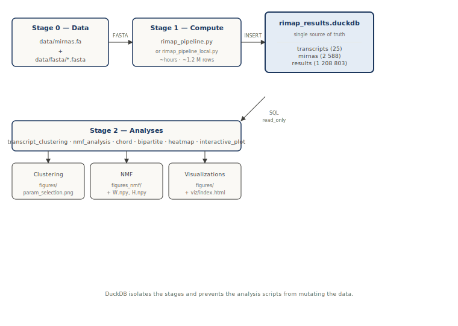
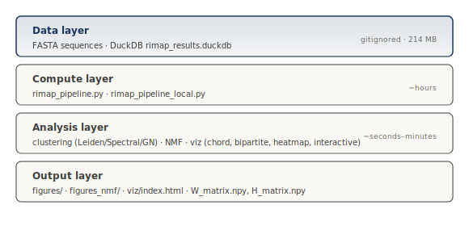

# Architecture

## Overview

The project transforms FASTA sequences (miRNAs + transcripts) into an **affinity profile matrix** (2,516 × 25), then applies four clustering methods to identify functional miRNA signatures. The DuckDB database `rimap_results.duckdb` is the **single source of truth** between stages — all analysis scripts read it with `read_only=True`.

## Data flow



All analyses start from the **same aggregation**: for each `(mirna_id, transcript_id)` pair, we take the mean of the absolute values of `binding_dG` across all predicted sites. This convention is hard-coded in each analysis script (no shared function).
## Layers



```python
V[mirna, transcript] = mean(abs(binding_dG) for each site)
```

→ Matrix `V` of dimension **2,516 × 25** (miRNAs with no sites are filtered out).

## Common preprocessing — residual matrix

Three scripts use a residual transformation (`nmf_analysis.py`, `transcript_clustering.py`, `heatmap_by_cluster.py`):

```python
V_res[i, j] = max(0, V[i, j] − mean(V[:, j]))
```

Necessary because `V` has a **row CV of 0.06** (near-identical profiles between miRNAs). Without residualization, every clustering method puts 100% of miRNAs into a single group. Result: 58.7% of the residual matrix is non-zero — compatible with NMF.

## Conventions and invariants

Seven rules across every script:

1. **CWD is the repo root.** All scripts assume they are launched from the repo root.
2. **Headless matplotlib.** `matplotlib.use("Agg")` at the top of every viz script.
3. **Read-only DuckDB.** `duckdb.connect(..., read_only=True)` in analysis scripts. Only `rimap_pipeline*.py` opens for write.
4. **Warnings silenced.** `warnings.filterwarnings("ignore")` at the top of every script.
5. **Separators.** English dots (`0.06`) in everything. (Commas are not used anywhere.)
6. **External IDs.** miRNAs = `MIMAT*`, transcripts = `ENST*`.
7. **One function per script.** No inter-script imports. No `__init__.py`.

## Documented technical debt

The `TRANSCRIPT_GENE_MAP` mapping (transcript_id → gene_name + category) is duplicated in 6 scripts: `chord_diagram.py`, `heatmap_by_cluster.py`, `bipartite_top_heatmap.py`, `nmf_analysis.py`, `bipartite_by_cluster.py`, `bipartite_graph.py`. Adding a transcript requires updating the 6 files. Candidate refactor: extract into `scripts/constants.py`.

## Detailed execution pipeline

See [scripts/README.md](https://github.com/emericl/mirna-kras/blob/main/scripts/README.md) for the full list of scripts and their execution order.